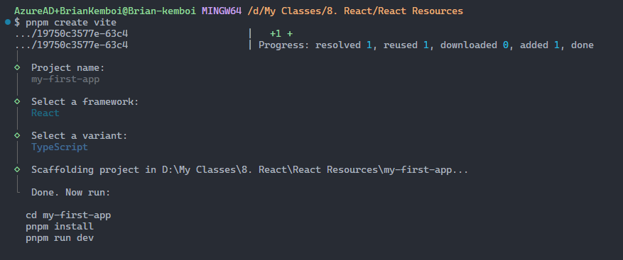
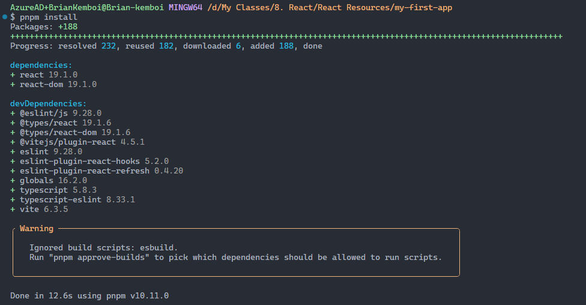
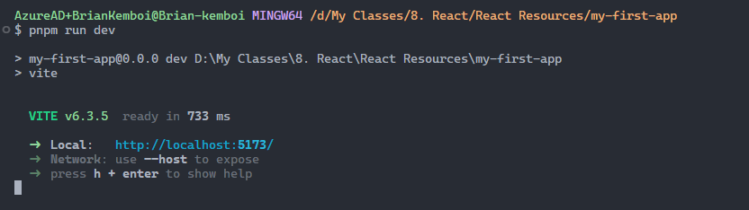

# Your First React App

* on your terminal:

  `pnpm create vite`
* click enter and write the name of the project i.e ***my-first-app***
* select **React** as the framework
* Select ***Typescript***

* change directory to the newly scafolded project: `cd my-first-app`
* On root of the project, install the dev dependancies, run the command: `pnpm install`

* Run your first react app: `pnpm run dev`
* This will create a port that react vite will be listening to i.e [http://localhost:5173](http://localhost:5173 "paste this on your browser")

* The url will launch a page written in React
* Congratulations, you have your first react app

